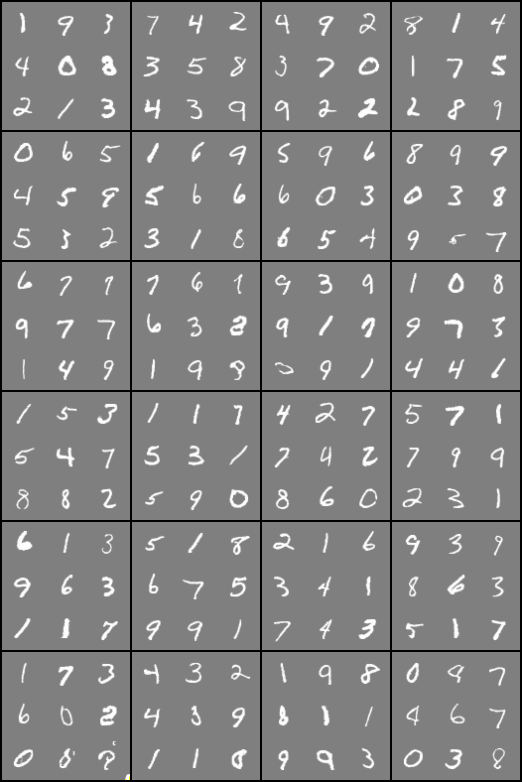
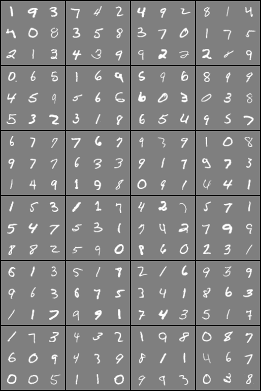
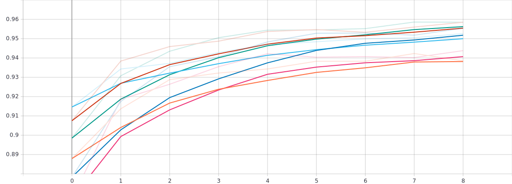

# LostGAN on MNIST
This work uses the LostGAN architecture on a grid of MNIST digits. Implementation is based on the paper below. 
(https://arxiv.org/abs/1908.07500)

This version: MNIST


## Network Structure
As presented in the LostGAN paper https://github.com/WillSuen/LostGANs


#### Train models
```
python train.py --dataset mnist --out_path outputs/
```

#### Run pretrained model
```
python test.py --dataset mnist --model_path model/G_<X>.pth --sample_path samples/mnist/
```
#### Evaluate using Classification Accuracy Score
```
python cas.py --sample_path samples/ --epochs 10 
```

## Results
###### Multiple fake images generated from same layout

###### Real images 

###### Accuracy plot from 15 to 40 epochs



## Reference
* Synchronized-BatchNorm-PyTorch: [https://github.com/vacancy/Synchronized-BatchNorm-PyTorch](https://github.com/vacancy/Synchronized-BatchNorm-PyTorch)
* Image Generation from Scene Graphs: [https://github.com/google/sg2im](https://github.com/google/sg2im)
* Faster R-CNN and Mask R-CNN in PyTorch 1.0: [https://github.com/facebookresearch/maskrcnn-benchmark](https://github.com/facebookresearch/maskrcnn-benchmark)
* Original implementation COCO and VG: https://github.com/WillSuen/LostGANs
